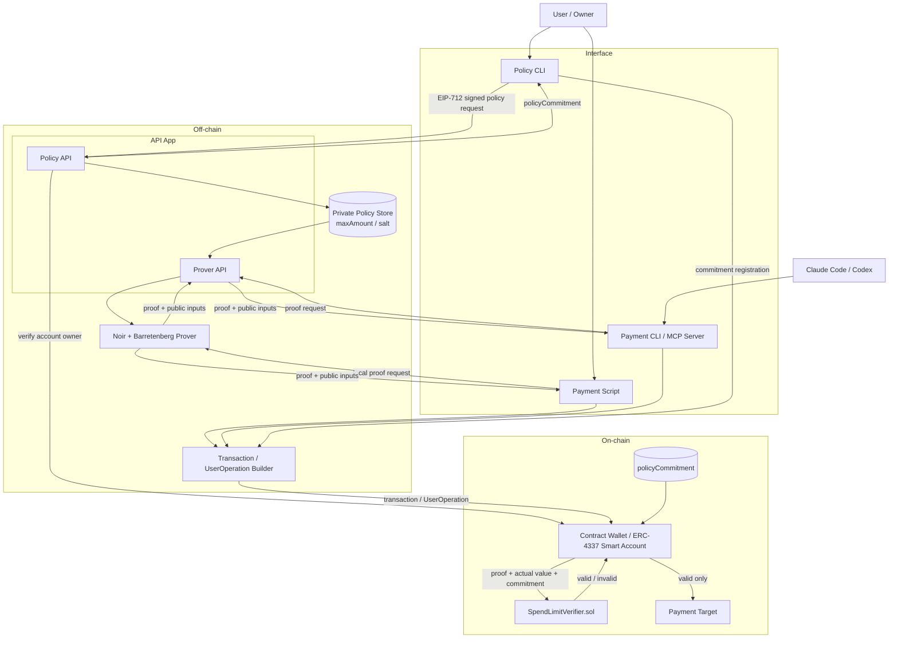

# ZK Policy Enforcement Layer

秘密の支出ポリシーをZK Proofで検証し、条件を満たす場合だけSmart Accountからトランザクションを実行するためのPoCです。

開発順序は[ロードマップ](docs/roadmap.md)、現在の実装範囲は[Phase 1 Epic](docs/epics/epic-01-zk-payment.md)を参照してください。

## Claude Codeでの正常系・異常系デモ

起動・自然言語プロンプト・期待結果・終了手順は[デモ手順書](demos/claude-payment/README.md)を参照してください。

```bash
pnpm demo:claude
```

## アーキテクチャ



Claude CodeとCodexは開発ツールであると同時に、将来はPayment CLIまたはMCP Serverを通じて決済機能を利用する呼び出し元になります。独立したAI Agentアプリは作りません。

ユーザーはAgentを経由せず、Policy CLIから支出上限を設定します。秘密のPolicyはOff-chainに保存し、Smart AccountにはPolicyそのものではなく`policyCommitment`だけを登録します。

Smart Accountの実装方針は次のとおりです。

- Phase 1では、Owner認証とZK Proof検証を持つ`ZkPolicyAccount.sol`を実装する
- Contract呼び出しは専用packageにせず、viemを使った`Payment Script`から始める
- Phase 3では、ERC-4337 Accountを自作するか既存AccountへValidatorを追加するかをADRで決定する
- ZK CircuitとSolidity VerifierはERC-4337固有の実装へ依存させない
- Safe Moduleではなく自作 Smart Account を選んだのは、Account の理解と将来の AI エージェントウォレットへの組み込みを見据えたためである。Safe Module 経路の別リポジトリ [zk-bound](https://github.com/br-to/zk-bound) との関係は [ADR-0016](docs/adr/adr-0016-custom-smart-account-over-safe-module.md) を参照する

## ディレクトリ構成

```text
.
├── apps/
│   ├── api/                       # Policy管理・Proof生成API
│   ├── policy-cli/                # OwnerがPolicyを設定するCLI
│   └── mcp-server/                # Claude Code/Codexから呼ぶMCP Server
├── circuits/
│   └── spend-limit/               # Noir CircuitとCircuitテスト
├── contracts/
│   ├── src/
│   │   ├── ZkPolicyAccount.sol    # 最初のContract Wallet
│   │   └── verifiers/
│   │       └── generated/         # Noirから生成したSolidity Verifier
│   ├── test/                      # Forgeテスト
│   └── script/                    # デプロイスクリプト
├── packages/
│   ├── policy/                    # Policy、Public Input、Intentの共通型
│   └── prover/                    # NoirJSとBarretenbergのラッパー
├── scripts/                       # Proof生成・Contract呼び出し
├── e2e/                           # Proof生成から決済までの結合テスト
├── slides/                        # 発表用Slidevプロジェクト（独立したpnpm project）
├── docs/
│   ├── roadmap.md
│   ├── epics/                     # Phase単位の計画と進捗
│   ├── stories/                   # ユーザーアクションと受け入れ条件
│   ├── tasks/                     # Storyを構成する実装作業
│   ├── adr/                       # 合意済みの設計判断
│   ├── audits/                    # Epic完了時の監査結果
│   ├── security/                  # 脅威モデル
│   └── reviews/                   # 外部リポジトリからの選択的取り込み記録
├── CONTRIBUTING.md
├── SECURITY.md
├── llm-wiki/
│   ├── raw/                       # 人間が追加する不変の一次資料
│   └── wiki/                      # LLMが管理する再利用可能な知識
├── guidelines/
│   ├── common.md
│   ├── apps.md
│   ├── circuits.md
│   └── contracts.md
├── AGENTS.md                      # Codex向けProject Instructions
├── CLAUDE.md                      # Claude Code向けProject Instructions
├── package.json
└── pnpm-workspace.yaml
```

## 利用技術

| 領域 | 技術 | 用途 |
|---|---|---|
| 言語 | TypeScript | API、MCP Server、スクリプト |
| 実行環境 | Node.js | TypeScriptアプリケーションの実行 |
| Package管理 | pnpm workspace | TypeScriptパッケージの管理 |
| ZK Circuit | [Noir](https://noir-lang.org/docs/) / Nargo | 支出ポリシーの制約、テスト、fuzz |
| ZK証明方式 | UltraHonk（zk-SNARK系、EVM向けKeccak設定） | オンチェーンで検証するZK Proof |
| Proving Backend | Barretenberg (`bb` / `bb.js`) | UltraHonk Proof、Verification Key、Solidity Verifierの生成 |
| Contract | Solidity | VerifierとSmart Accountの実装 |
| Contract開発 | [Foundry](https://getfoundry.sh/) | ビルド、テスト、デプロイ |
| Ethereum Client | [viem](https://viem.sh/) | Contract呼び出しとトランザクション送信 |
| API | [Hono](https://hono.dev/) | Proof生成APIとMCP ServerのHTTP実行環境 |
| Schema | Zod | 外部入力とTransaction Intentの検証 |
| TypeScriptテスト | Vitest | Unitテストと結合テスト |
| Account Abstraction | ERC-4337 / `viem/account-abstraction` | UserOperation構築と送信 |
| Agent Interface | MCP / CLI | Claude CodeとCodexからの決済機能呼び出し |

Bundler、RPC、ERC-4337 Account実装はPhase 3の着手前に決定します。

## 用語

### Solidity Verifier

Noir CircuitとBarretenbergから生成する、ZK Proof検証専用のSmart Contractです。ProofとPublic Inputを受け取り、Circuitで定義した制約が成立するProofかを検証します。秘密の`maxAmount`と`salt`は受け取りません。

### policyCommitment

秘密のPolicyを公開せず、ユーザーが設定したPolicyを固定するための値です。

```text
policyCommitment = hash(maxAmount, salt)
```

Smart Accountには`policyCommitment`だけを保存します。`salt`はCommitment作成時だけでなく、毎回のProof生成時にPrivate Inputとして使用します。Circuitは`maxAmount`と`salt`からCommitmentを再計算し、Smart Accountに登録された値と一致することを検証します。

`salt`はPolicyごとに生成する暗号学的乱数です。上限額は候補が少なく推測されやすいため、`hash(maxAmount)`だけでは候補額を総当たりして上限を特定できます。秘密の`salt`を加えることで、この推測を困難にします。

### Policy更新の認証

Policyの作成・更新は、Owner EOAがEIP-712形式のPolicy更新リクエストへ署名して認証します。

```text
PolicyUpdate:
  account
  policyCommitment
  nonce
  expiry
  chainId
```

Policy APIは次を検証します。

- EIP-712署名から復元したAddressが`ZkPolicyAccount`のOwnerである
- APIが払い出したnonceと一致する
- expiryを過ぎていない
- 受信した`maxAmount`と`salt`から再計算したCommitmentが署名対象と一致する

APIはOwner Keyを保持しません。CommitmentをAccountへ登録するTransactionもPolicy CLIからOwnerが署名します。

## Noirを採用する理由

Phase 1のZK CircuitにはNoirを採用します。

- Nargoでコンパイル、実行、テスト、fuzzを一貫して扱える
- NoirJSを通じてTypeScriptのProof APIへ接続できる
- BarretenbergからProof、Verification Key、Solidity Verifierを生成できる
- ポリシー追加時にCircomより通常のプログラミング言語に近い形で制約を記述できる

CircomとsnarkjsもSolidity Verifierを生成でき、Groth16、PLONK、FFLONKを選択できる成熟した候補です。一方で、Groth16はCircuitごとのtrusted setupが必要であり、Phase 1ではNoirの方が開発フローを小さく保てます。

オンチェーン検証のガス、Verifierのサイズ、Proof生成時間が要件を満たさない場合は、Phase 1の計測結果を基にCircomを再評価します。

## 責務分離

- ユーザーはPolicy CLIから秘密のPolicyを設定する
- Claude CodeとCodexはPayment CLIまたはMCP Serverから決済機能を呼び出す
- Proverは秘密のPolicyを使ってProofを生成する
- Transaction BuilderはIntentからTransactionまたはUserOperationを組み立てる
- Smart Accountは実際の実行内容を使ってProofを検証する
- Solidity VerifierはCircuitで定義した制約の成立だけを検証する
- Claude CodeとCodexに秘密のPolicyやOwner Keyを渡さない

開発ルールは[guidelines](guidelines/common.md)で管理します。貢献手順は[CONTRIBUTING.md](CONTRIBUTING.md)、脆弱性報告は[SECURITY.md](SECURITY.md)、脅威モデルは[docs/security/threat-model.md](docs/security/threat-model.md)を参照してください。

## Phase 1のローカル実行

Phase 1はローカルAnvilだけを対象にする。デプロイ・送金コードはHTTPのloopback addressと
chain ID `31337`以外を拒否する。

固定ツールチェーンは[`.tool-versions`](.tool-versions)を参照する。NoirとBarretenbergは
対応するversion managerで同じversionを導入する。

```sh
noirup --version 1.0.0-beta.26
bbup --version 5.2.0
pnpm install
```

全成果物を生成してテストする。

```sh
pnpm build
pnpm test
```

Proof生成からVerifier・Accountのデプロイ、0.01 ETHの送金、残高差分の検証までを、
スクリプトが一時的に起動するAnvil上で実行する。

```sh
pnpm local:payment
```

CircuitとVerifierを変更した場合、生成Verifierを次のコマンドで再生成する。生成された
`contracts/src/verifiers/generated/SpendLimitVerifier.sol`は手動編集しない。

```sh
pnpm generate:verifier
```
