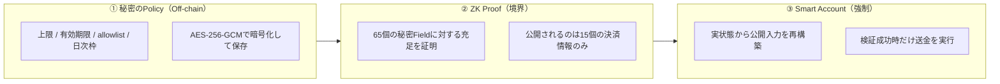
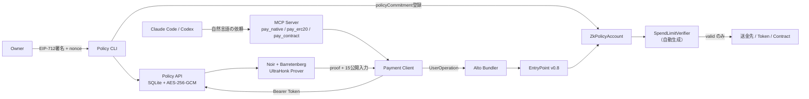
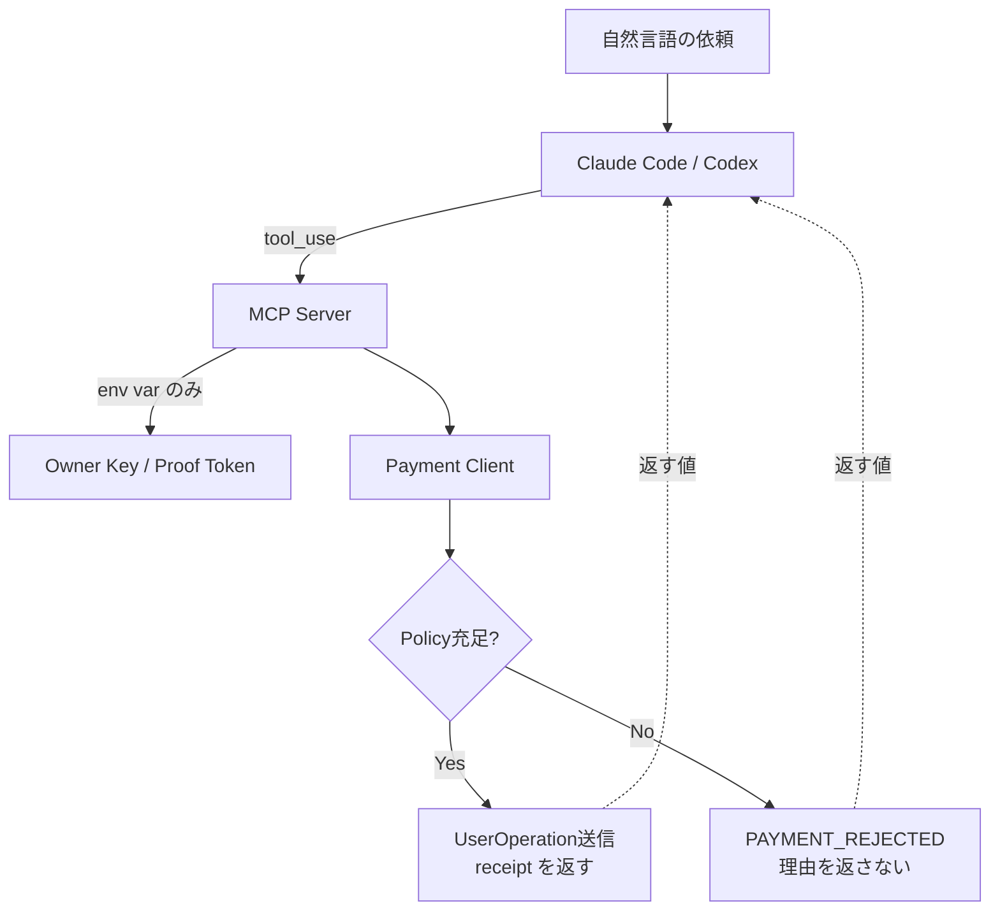
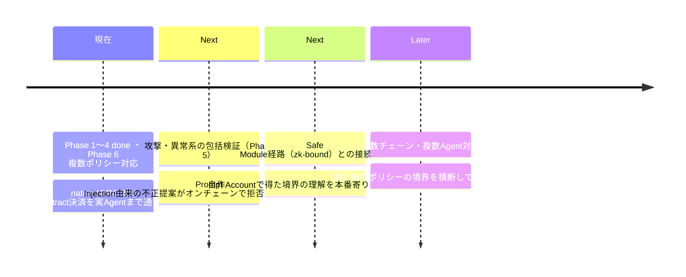

<div class="text-xs tracking-widest uppercase opacity-50 font-mono">Komlock-lab / zk-policy-poc</div>

# ZK Policy Enforcement Layer

エージェントに秘密の支出ポリシーを渡さず、<br>
ZK Proofで送金の境界を強制するSmart Account基盤

<div class="flex gap-6 pt-8 text-sm font-mono opacity-70">
  <span>Noir + UltraHonk</span>
  <span class="opacity-40">/</span>
  <span>ERC-4337</span>
  <span class="opacity-40">/</span>
  <span>MCP</span>
</div>

<!--
このPoCは「AIエージェントに財布を持たせる」ことを、
人間の都度承認ではなく暗号的な境界で成立させられるかを検証したもの。
-->

---

# 課題 — エージェントに財布を渡せない理由

## ガードレールが「読める場所」にある限り、越えられる

<div class="grid grid-cols-2 gap-6 pt-2">

<div class="border rounded p-4 opacity-80">
<div class="text-xs uppercase tracking-wider opacity-60 font-mono pb-2">従来のガードレール</div>

- ルールがプロンプトやアプリコードの中にある
- **エージェント自身がルールの中身を読める**
- Prompt Injectionや実装バグで迂回の余地が残る
- 都度の人間承認に戻すと、自律性が失われる

</div>

<div class="border rounded p-4" style="border-color:#0c6b86">
<div class="text-xs uppercase tracking-wider font-mono pb-2" style="color:#0c6b86">ZK Policyのガードレール</div>

- ルールはOff-chainの秘密のまま保持する
- **エージェントにもオンチェーンにも中身を見せない**
- 「条件を満たした」ことだけをZK Proofで証明する
- 検証はEVM上で完結し、第三者の判定を挟まない

</div>

</div>

<div class="border rounded p-3 mt-5 text-sm">
人間がPolicy CLIで境界を一度設定すれば、以降エージェントはその境界の内側だけで自律的に送金できる。境界は「守るべきルール」ではなく「実行できない領域」になる。
</div>

<!--
ポイントは信頼の置き場所を変えること。
エージェントを信頼して守らせるのではなく、
エージェントが何を提案してもAccountが実行しない構造にする。
-->

---

# 解決の構造 — 3つの層で境界をつくる



<div class="grid grid-cols-4 gap-3 pt-5 text-sm">
  <div class="border rounded p-3">
    <div class="text-xs opacity-60 font-mono">1回あたり上限</div>
    <div class="font-semibold">asset別</div>
  </div>
  <div class="border rounded p-3">
    <div class="text-xs opacity-60 font-mono">有効期限</div>
    <div class="font-semibold">issuedAt〜validUntil</div>
  </div>
  <div class="border rounded p-3">
    <div class="text-xs opacity-60 font-mono">allowlist</div>
    <div class="font-semibold">送金先 / Token / Contract</div>
  </div>
  <div class="border rounded p-3">
    <div class="text-xs opacity-60 font-mono">日次累積上限</div>
    <div class="font-semibold">UTC 1日・asset別</div>
  </div>
</div>

<div class="text-xs opacity-50 pt-3 font-mono">
条件はORや優先順位を持たず、すべてANDで単一Commitmentに合成する（ADR-0012）
</div>

<!--
複数条件は「1つのPolicyに含まれる複数条件のAND」と定義した。
ORや優先順位を入れると、どの条件で通ったかが観測から推測できてしまう。
-->

---

# アーキテクチャ — 秘密はOff-chainに残る



<div class="grid grid-cols-2 gap-4 pt-3 text-sm">
  <div>🔒 <b>境界を越えないもの</b><br><span class="opacity-60">maxAmount / dailyLimit / allowlist / salt / Owner Key / Proof Token</span></div>
  <div>🌐 <b>境界を越えるもの</b><br><span class="opacity-60">proof / policyCommitment / 実送金額 / recipient / dayId / spentBefore</span></div>
</div>

<!--
Owner KeyとProof Tokenは、Hostから名前を限定した環境変数でstdio MCP Serverへ渡し、
決済Client内部だけで使う。Tool引数にもレスポンスにも一切現れない。
-->

---

# Policyの構造 — 65個の秘密 / 15個の公開

<div class="grid grid-cols-2 gap-5 text-sm">

<div>
<div class="text-xs uppercase tracking-wider font-mono pb-2" style="color:#7b2d52">秘密入力: 65 Field（Circuitのみが見る）</div>

| 位置 | 内容 |
| --- | --- |
| `s[0..1]` | schemaVersion / maxValiditySeconds |
| `s[2..19]` | recipient allowlist（最大16、昇順） |
| `s[20..44]` | asset rules 最大8件<br>`(asset, maxAmount, dailyLimit)` |
| `s[45..62]` | contract allowlist（最大16、昇順） |
| `s[63]` | 日次条件の有効フラグ |
| `s[64]` | **salt**（Policyごとの秘密乱数） |

<div class="text-xs opacity-60 pt-2">
未使用の枠はzeroで正規化し、有効長の外側がzeroであることも回路が検査する。
</div>
</div>

<div>
<div class="text-xs uppercase tracking-wider font-mono pb-2" style="color:#0c6b86">公開入力: 15 Field（Verifierに渡る）</div>

| Index | 内容 |
| --- | --- |
| `0-3` | schemaVersion / chainId / account / **policyCommitment** |
| `4-6` | kind（0 native / 1 ERC-20 / 2 contract）/ recipient / asset |
| `7-8` | amount / target |
| `9-10` | invoiceId（bytes32を上位・下位128bitに分割） |
| `11-12` | issuedAt / validUntil |
| `13-14` | dayId / spentBefore |

<div class="text-xs opacity-60 pt-2">
公開入力は決済の全構成要素を含む。1つでも変えるとProofは通らない（transaction binding）。
</div>
</div>

</div>

<div class="border rounded p-3 mt-3 text-sm">
<code>policyCommitment = Poseidon2(65個すべての秘密Field)</code> ── 上限額は候補が少なく総当たりで推測されやすいため、256bitの<code>salt</code>をCommitmentに含めて推測を困難にしている。
</div>

<!--
上限値そのものは隠すが、観測されたvalueから下限は推測できる。
privacy claimはこの範囲を超えない、と脅威モデルに明記している。
-->

---

# 回路が証明すること — Noirで書いた制約のAND

```rust
// circuits/spend-limit/src/main.nr
fn main(public_inputs: pub [Field; 15], policy_fields: [Field; 65]) {
```

<div class="grid grid-cols-2 gap-5 text-sm pt-1">

<div>

**① 型と範囲の拘束**
address は160bit、金額はu128、時刻はu64に拘束する。`Field`のまま扱うとoverflowで比較を破れる。

**② allowlistの照合**
`recipient == p[5]` を有効長の範囲だけでOR集約。配列は昇順・重複なしを`lt`で強制し、重複による水増しを防ぐ。

**③ asset別の1回上限**
`amount <= maxAmount` を、公開`asset`と一致する行についてのみ成立させる。

</div>

<div>

**④ 日次累積**
`spentBefore + amount <= dailyLimit`。加算はu128域で揃える。

**⑤ 有効期限**
`validUntil - issuedAt <= maxValiditySeconds`。Policy側が「窓の長さ」を秘密として持つ。

**⑥ 種別ごとの整合**
native/Contractは`asset == 0 && target == recipient`、ERC-20は`asset != 0 && target == asset`。invoiceIdはkind 2以外でzero。

**⑦ Commitment照合**
`Poseidon2::hash(s, 65) == p[3]` ── 別のPolicyへの差し替えを防ぐ最後の錠。

</div>

</div>

<div class="text-xs opacity-60 pt-4 font-mono">
Noir 1.0.0-beta.26 / Barretenberg 5.2.0 ・ EVM向けKeccak設定のUltraHonk ・ Solidity Verifierは自動生成し手動編集しない（ADR-0003）
</div>

<!--
条件を追加するたびに新しい回路を作るのではなく、
1つの回路の中でフラグ付きのAND制約として積み増した。
無効化した条件は「対応する秘密値がzeroであること」まで検査する。
-->

---

# オンチェーン強制 — Accountは公開入力を自分で作る

<div class="grid grid-cols-2 gap-5">

<div>

```solidity
// ZkPolicyAccount._executePolicyPayment
publicInputs[1] = bytes32(block.chainid);
publicInputs[2] = uint160(address(this));
publicInputs[3] = policyCommitment;
publicInputs[7] = bytes32(value);
publicInputs[13] = bytes32(dayId);
publicInputs[14] = bytes32(spentBefore);

if (!verifier.verify(proof, publicInputs))
    revert InvalidProof();

dailySpend[asset] = DailySpend(dayId, spentBefore + value);
// ↑ 累積更新は外部呼出しの前
```

</div>

<div class="text-sm">

**Clientが渡すのはproofだけ。** 15個の公開入力はすべてAccountが実状態から再構築する。Client側の申告値を信用する余地がない。

**replayが成立しない。** 実行のたびに`spentBefore`が進むため、同じ公開入力のproofは二度通らない。zk-boundがSafeごとのmodule nonceで防いだ再送を、日次累積の状態遷移で吸収している。

**時刻はチェーンが判定する。** `block.timestamp`が`issuedAt`〜`validUntil`の外なら`InvalidPaymentTime`でrevertする。

**fail closed。** 検証失敗をwarningやpermissive fallbackに変えない。`PolicyNotConfigured` / `Unauthorized` / `InvalidProof`はすべてrevert。

</div>

</div>

<div class="text-xs opacity-60 pt-3">
Owner直接実行（<code>execute*</code>）とEntryPoint経由（<code>execute*UserOp</code>）は呼出し元検査だけを分け、Policy検証は同一経路を通る。
</div>

<!--
ここが設計の中心。
「Proofが正しい」ことと「そのProofがこの決済のものである」ことは別の問題で、
後者はAccountが公開入力を自分で組み立てることでしか保証できない。
-->

---

# 攻撃と防御 — 何を守り、何を守らないか

<div class="text-sm">

| 攻撃 | 防御 | 結果 |
| --- | --- | --- |
| Injectionで攻撃者宛の全額送金を提案させる | value / recipient / asset / contract の制約 | Proofを生成できない、またはAccountが実行しない |
| 正常なproofを別の操作へ転用する | 15公開入力による完全なtransaction binding | chainId・account・kind・amount等の変更でrevert |
| 正常なproofを再送する | account + chainId + 有効期間 + 日次累積 | 同じproofの再実行がrevert |
| 期限切れ後に送信する | オンチェーンのtimestamp検査 | `InvalidPaymentTime` |
| オンチェーンデータからPolicyを復元する | saltを含むhiding commitment | 平文はevent・calldata・公開入力のどこにもない |
| Policy設定そのものを乗っ取る | Owner のEIP-712署名 + API nonce | 任意EOA・AgentはCommitmentもAPIも更新できない |

</div>

<div class="grid grid-cols-2 gap-4 pt-4 text-sm">
  <div class="border rounded p-3">
    <b>明示している限界</b><br>
    <span class="opacity-70">value・recipient・dayId・spentBeforeは公開。観測されたvalueから上限の<b>下限</b>は推測できる。privacy claimはこの範囲を超えない。</span>
  </div>
  <div class="border rounded p-3">
    <b>PoCの対象外</b><br>
    <span class="opacity-70">prover deviceのmalware、Owner Key漏えい、実装バグ、MEV・reorg、allowlisted contract自体の悪意。</span>
  </div>
</div>

<!--
脅威モデルはzk-boundのものをSafe Moduleを除いて本リポジトリの実行境界へ写した。
守れないものを守れると言わないことを、監査の合格条件に含めている。
-->

---

# Agent境界 — 秘密に触れずに決済を完了する

<div class="grid grid-cols-2 gap-5">

<div class="text-sm">

**公開するのは3つのToolだけ**

`pay_native` / `pay_erc20` / `pay_contract`。raw signing、Proof取得、任意calldata、Policy更新のToolは公開しない。

**Hostの権限を絞る**

credentialを持つHostではClaude CodeのBashをdeny、Codexのshellを無効化する。modelがHost環境を参照する能力自体を渡さない。

**失敗は定型化する**

拒否時の応答は`PAYMENT_REJECTED`固定。上限に近い値を投げて反応を見るoracleにさせない。

**transcriptに秘密を残さない**

Tool入力・MCP応答・stdout・診断ログ・Agent transcriptのいずれにも、秘密値とproofを含めない。

</div>

<div>



<div class="text-xs opacity-60 pt-1">
返すのは policyId / version / userOpHash / txHash / status のみ
</div>

</div>

</div>

<!--
Phase 4のADR-0011で「呼出しごとの人間承認なし」を明示的に選んだ。
毎回承認するとPolicyによる自律制御を検証できないため。
-->

---

# デモ — 境界は「Proofが作れない」段階で閉じる

<div class="grid grid-cols-2 gap-4">

```bash
# 正常系
$ pnpm local:payment
policy   : maxAmount = 0.1 ETH (secret)
payment  : 0.01 ETH -> allowed recipient
✔ proof generated        (15 public inputs)
✔ verifier: valid
✔ dailySpend: 0 -> 0.01 ETH
✔ balance +0.01 ETH
```

```bash
# 異常系
$ pnpm local:payment --value 1
policy   : maxAmount = 0.1 ETH (secret)
payment  : 1 ETH -> allowed recipient
✘ circuit constraint violated
  "value exceeds max amount"
✘ proof not generated
→ transaction未送信・残高変化なし
```

</div>

<div class="grid grid-cols-3 gap-3 pt-4 text-sm">
  <div class="border rounded p-3">
    <div class="text-xs opacity-60 font-mono">native + Contract決済</div>
    <div>同じ日次枠を共有。.03 + .02 + .01 ETH で累積.06 ETH</div>
  </div>
  <div class="border rounded p-3">
    <div class="text-xs opacity-60 font-mono">ERC-20</div>
    <div>Token address別に計上。10 + 20 = 30、nativeの累積は不変</div>
  </div>
  <div class="border rounded p-3">
    <div class="text-xs opacity-60 font-mono">Policy更新</div>
    <div>allowlistから外して戻しても当日の実績を引き継ぐ</div>
  </div>
</div>

<div class="border rounded p-3 mt-3 text-sm">
<b>Agent経由でも同じ境界:</b> Claude Code / Codexへ自然言語で依頼 → 3 Toolがそれぞれ1回呼ばれ、上限内は追加承認なしに成功。上限超過はUserOperation送信前に拒否され、秘密の<code>maxAmount</code>・<code>salt</code>はtranscriptに現れない。
</div>

<!--
Proof生成の失敗は「証明できない」であって「拒否された」ではない。
攻撃者から見ると、なぜ失敗したかの情報が返らないのが重要。
-->

---

# 実測 — PoCとして成立している範囲

<div class="grid grid-cols-2 gap-6">

<div>

<div class="text-xs uppercase tracking-wider opacity-60 font-mono pb-2">複合Policy回路（実測）</div>

| 指標 | 値 |
| --- | --- |
| ACIR opcodes | 4,314 |
| Brillig opcodes | 87 |
| Proof size | 8,000 bytes |
| 生成時間 | 936 ms（単発） |

<div class="text-xs opacity-60 pt-2">
7条件を1回路のANDに合成しても、ローカルで1秒未満に収まる規模。
</div>

</div>

<div>

<div class="text-xs uppercase tracking-wider opacity-60 font-mono pb-2">テスト（全passで監査合格）</div>

| 層 | 件数 |
| --- | --- |
| Circuit | 11 |
| Contract（fuzz各256 runs） | 39 |
| unit / API / Client / MCP | 103 |
| local E2E | 27 |
| 実Agent E2E（Claude 2 / Codex 5） | 7 |

</div>

</div>

<div class="text-xs opacity-60 pt-4 font-mono">
固定版: Node 23.3.0 / pnpm 10.18.1 / nargo 1.0.0-beta.26 / bb 5.2.0 / forge 1.5.1 / EntryPoint v0.8 + Alto / 非fork Anvil chain 31337
</div>

<div class="border rounded p-3 mt-3 text-sm">
統合監査（audit-06）判定 <b>passed</b> ── CRITICAL/HIGH 0件、MEDIUM/LOW 0件、修正iteration 0。ADR・ZK・Contract・API/秘密の4分野を独立レビュー。
</div>

<!--
実Agent E2Eは、tool_useを構造化して検査している。
初期は文字列一致で誤検出していたため、そこを直して合格させた。
失敗した試行を成功に数えない、を監査の運用ルールにしている。
-->

---

# 設計判断 — なぜこの形にしたか

<div class="text-sm">

| 判断 | 選んだ理由 | 捨てた選択肢 |
| --- | --- | --- |
| **Safe Moduleではなく自作Smart Account**<br><span class="opacity-60">ADR-0016</span> | Account内部の認証・UserOperation検証・EntryPoint境界・Proof検証の順序を自分で追う。将来AIエージェントウォレットへ組み込む判断の前提になる | Safe + `ZkPolicySafeModule`（別リポジトリ zk-bound が担う経路） |
| **単一Commitmentへの条件合成**<br><span class="opacity-60">ADR-0012</span> | 配線とVerifierを増やさず、固定長比較で全条件をANDにできる | 条件ごとの個別Proof / Merkle allowlist |
| **`Poseidon2(fields, salt)`**<br><span class="opacity-60">ADR-0003</span> | 上限額は候補が少なく、saltなしでは総当たりで復元できる | `hash(maxAmount)`のみ / EVM側での再計算 |
| **オンチェーン日次累積**<br><span class="opacity-60">ADR-0014</span> | Accountが実績を参照できる。Proof生成回数と決済回数を混同しない | Off-chain集計 / 秘密状態Commitment / ローリング24時間 |
| **暗号化Policy + Bearer Token**<br><span class="opacity-60">ADR-0006</span> | DB fileの取得だけでは秘密もProof取得権限も復元できない | 平文保存 / 認証なしProof API（上限推測oracleになる） |

</div>

<!--
ADR-0016は、Safe Moduleが本番寄りとして妥当だと認めたうえで、
理解のために自作を選んだと明記している。
比較記録も docs/reviews に残している。
-->

---

# 将来像 — PoCからエージェントウォレット基盤へ



<div class="grid grid-cols-2 gap-4 pt-3 text-sm">
  <div class="border rounded p-3">
    <b>今わかっている残存リスク</b><br>
    <span class="opacity-70">固定長allowlist（16/8/16）の上限、資産間の換算をしないこと、逐次実行前提で同時送信を扱わないこと。</span>
  </div>
  <div class="border rounded p-3">
    <b>次に検証したいこと</b><br>
    <span class="opacity-70">Injectionを与えたAgentが、Policy境界の外側へ一度も出られないことを、攻撃側の試行として測る。</span>
  </div>
</div>

<div class="border rounded p-4 mt-4">
<b>Vision —</b> エージェントに鍵を渡さず、証明だけを渡す。人間が境界を決め、エージェントがその内側で自律する。そんなウォレットレイヤーを目指す。
</div>

<!--
Phase 5をスキップして先にPhase 6へ進んだのは、
守るべき条件が揃う前に攻撃検証をしても、範囲が確定しないため。
条件が揃った今が攻撃検証の入り口になる。
-->

---
layout: center
class: text-left
---

# ご清聴ありがとうございました

エージェントに秘密を渡さず、境界だけを渡す。

<div class="pt-8 text-sm font-mono opacity-60">
GitHub: Komlock-lab / zk-policy-poc<br>
設計判断は docs/adr/ ・ 脅威モデルは docs/security/threat-model.md
</div>

<style>
h1 { font-weight: 700; letter-spacing: -0.02em; }
h2 { font-size: 1.15rem; font-weight: 500; opacity: 0.75; margin-bottom: 1.2rem; }
table { font-size: 0.85em; }
th { text-align: left; opacity: 0.6; font-weight: 500; }
td, th { padding: 0.35rem 0.6rem; }
code { font-size: 0.9em; }
</style>
