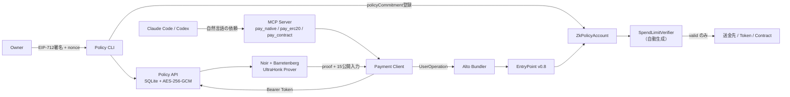
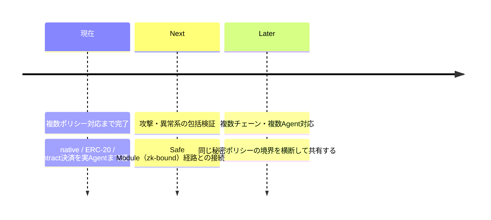

<div class="text-xs tracking-widest uppercase opacity-50 font-mono">Komlock-lab / zk-policy-poc</div>

# ZK Policy Enforcement Layer

エージェントに秘密の支出ポリシーを渡さず、<br>
ZK Proofで送金の境界を強制するSmart Account基盤

<div class="flex gap-6 pt-8 text-sm font-mono opacity-70">
  <span>Noir + UltraHonk</span>
  <span class="opacity-40">/</span>
  <span>ERC-4337</span>
  <span class="opacity-40">/</span>
  <span>MCP</span>
</div>

<!--
【構成】サービス（概要・目的・アーキテクチャ）2分 → ZK説明 1分 → デモ 2分。

このPoCは「AIエージェントに財布を持たせる」ことを、
人間の都度承認ではなく暗号的な境界で成立させられるかを検証したもの。
-->

---

<div class="text-xs tracking-widest uppercase opacity-50 font-mono">サービス — 概要</div>

# エージェントの送金を、ZK Proofで検証してから実行する

Claude Code / Codexが自然言語の依頼から生成した送金を、秘密の支出ポリシーに対するProofで検証し、条件を満たすときだけERC-4337 Smart Accountが実行する。

<div class="grid grid-cols-4 gap-3 pt-3 text-sm">
  <div class="border rounded p-3">
    <div class="text-xs opacity-60 font-mono pb-1">1回あたり上限</div>
    <div class="font-semibold">asset別に設定</div>
    <div class="text-xs opacity-60">native / Tokenごとに別の上限</div>
  </div>
  <div class="border rounded p-3">
    <div class="text-xs opacity-60 font-mono pb-1">有効期限</div>
    <div class="font-semibold">issuedAt 〜 validUntil</div>
    <div class="text-xs opacity-60">窓の長さ自体を秘密に持つ</div>
  </div>
  <div class="border rounded p-3">
    <div class="text-xs opacity-60 font-mono pb-1">allowlist</div>
    <div class="font-semibold">送金先 / Token / Contract</div>
    <div class="text-xs opacity-60">最大 16 / 8 / 16 件</div>
  </div>
  <div class="border rounded p-3">
    <div class="text-xs opacity-60 font-mono pb-1">日次累積上限</div>
    <div class="font-semibold">UTC 1日・asset別</div>
    <div class="text-xs opacity-60">実支出をAccountが計上</div>
  </div>
</div>

<div class="grid grid-cols-3 gap-4 pt-4 text-sm">
  <div>
    <div class="text-xs opacity-60 font-mono pb-1">対応する決済</div>
    native送金 / ERC-20転送 / Contractのinvoice決済（<code>pay(bytes32)</code>）の3種別
  </div>
  <div>
    <div class="text-xs opacity-60 font-mono pb-1">エージェントへの入口</div>
    MCPの3 Tool — <code>pay_native</code> / <code>pay_erc20</code> / <code>pay_contract</code>
  </div>
  <div>
    <div class="text-xs opacity-60 font-mono pb-1">進捗</div>
    Phase 1〜4 done、Phase 6 複数ポリシー対応まで実Agentで疎通済み
  </div>
</div>

<div class="text-sm opacity-70 pt-4">
条件はORや優先順位を持たず、すべてANDで単一のCommitmentに合成する。どの条件で通ったかが観測から推測できないようにするため。
</div>

<!--
複数条件は「1つのPolicyに含まれる複数条件のAND」と定義した（ADR-0012）。
ORや優先順位を入れると、どの条件で通ったかが観測から推測できてしまう。
-->

---

<div class="text-xs tracking-widest uppercase opacity-50 font-mono">サービス — 目的</div>

# ガードレールが「読める場所」にある限り、越えられる

エージェントに財布を持たせられない理由は、資金の大きさではなくルールの置き場所にある。

<div class="grid grid-cols-2 gap-6 pt-3">

<div class="border rounded p-4 opacity-80">
<div class="text-xs uppercase tracking-wider opacity-60 font-mono pb-2">従来のガードレール</div>

- ルールが**プロンプトやアプリコード**の中にある
- エージェント自身がルールの中身を読める
- Prompt Injectionや実装バグで迂回の余地が残る
- 都度の人間承認に戻すと、自律性そのものが失われる

</div>

<div class="border rounded p-4" style="border-color:#0c6b86">
<div class="text-xs uppercase tracking-wider font-mono pb-2" style="color:#0c6b86">ZK Policyのガードレール</div>

- ルールは**Off-chainの秘密**のまま保持する
- エージェントにもオンチェーンにも中身を見せない
- 「条件を満たした」ことだけをZK Proofで証明する
- 検証はEVM上で完結し、第三者の判定を挟まない

</div>

</div>

<div class="border rounded p-3 mt-5 text-sm">
<b>信頼の置き場所を変える。</b> エージェントを信頼して守らせるのではなく、エージェントが何を提案してもAccountが実行しない構造にする。境界は「守るべきルール」ではなく<b>「実行できない領域」</b>になる。
</div>

<!--
ここが目的の核心。
守らせるのではなく、実行できなくする。
-->

---

<div class="text-xs tracking-widest uppercase opacity-50 font-mono">サービス — アーキテクチャ</div>

# 秘密はOff-chainに残り、境界を越えるのはProofだけ



<div class="grid grid-cols-2 gap-4 pt-3 text-sm">
  <div>🔒 <b>境界を越えないもの</b><br><span class="opacity-60">maxAmount / dailyLimit / allowlist / salt / Owner Key / Proof Token</span></div>
  <div>🌐 <b>境界を越えるもの</b><br><span class="opacity-60">proof / policyCommitment / amount / recipient / dayId / spentBefore</span></div>
</div>

<div class="text-sm opacity-70 pt-3">
Owner KeyとProof Tokenは、Hostから名前を限定した環境変数でstdio MCP Serverへ渡し、決済Client内部だけで使う。Tool引数にもレスポンスにも一切現れない。
</div>

<!--
ここまでで2分。
図は左から右に「Ownerが秘密を設定 → Agentが依頼 → オンチェーンで強制」と読む。
-->

---

<div class="text-xs tracking-widest uppercase opacity-50 font-mono">ZK — 何を証明し、どう強制するか</div>

# 65個の秘密に対する充足を、15個の公開だけで示す

<div class="grid grid-cols-2 gap-5 text-sm pt-1">

<div>
<div class="text-xs uppercase tracking-wider font-mono pb-1" style="color:#7b2d52">policy_fields[65] — Circuitだけが見る</div>

| 位置 | 内容 |
| --- | --- |
| `s[1]` | maxValiditySeconds |
| `s[4..19]` | recipients[16]（昇順） |
| `s[21..44]` | assets[8] × (asset, maxAmount, dailyLimit) |
| `s[47..62]` | contracts[16]（昇順） |
| `s[64]` | **salt**（秘密乱数） |

<div class="text-xs pt-2">
<code>policyCommitment = Poseidon2(65個すべて)</code><br>
<span class="opacity-60">上限額は候補が少なく総当たりで復元できるため、saltをCommitmentに含めている。</span>
</div>
</div>

<div>
<div class="text-xs uppercase tracking-wider font-mono pb-1" style="color:#0c6b86">public_inputs[15] — Verifierに渡る</div>

| Index | 内容 |
| --- | --- |
| `1-3` | chainId / account / **policyCommitment** |
| `4-6` | kind（native/ERC-20/contract）/ recipient / asset |
| `7-8` | amount / target |
| `9-10` | invoiceId（上位・下位128bit） |
| `11-14` | issuedAt / validUntil / dayId / spentBefore |

<div class="text-xs pt-2">
<b>決済の全構成要素が公開入力に入る。</b><br>
<span class="opacity-60">1つでも変えるとProofは通らない（transaction binding）。</span>
</div>
</div>

</div>

<div class="grid grid-cols-2 gap-5 text-sm pt-3">

<div>
<div class="text-xs uppercase tracking-wider opacity-60 font-mono pb-1">回路が証明すること — すべてAND</div>

- **allowlist照合** — 有効長だけをOR集約。昇順・重複なしを`lt`で強制
- **asset別1回上限** — 公開`asset`と一致する行でのみ`amount <= maxAmount`
- **日次累積** — `spentBefore + amount <= dailyLimit`
- **有効期限** — `validUntil - issuedAt <= maxValiditySeconds`
- **Commitment照合** — `Poseidon2::hash(s, 65) == p[3]`

</div>

<div>
<div class="text-xs uppercase tracking-wider opacity-60 font-mono pb-1">Accountが強制すること</div>

```solidity
publicInputs[1]  = block.chainid;
publicInputs[3]  = policyCommitment;
publicInputs[14] = spentBefore;
if (!verifier.verify(proof, publicInputs))
    revert InvalidProof();
dailySpend[asset] = ... // 送金より前
```

<div class="text-xs opacity-70 pt-1">
Clientが渡すのは<b>proofだけ</b>。実行のたびに<code>spentBefore</code>が進むため、<b>同じproofは二度通らない</b>。
</div>
</div>

</div>

<!--
ここが1分。
「Proofが正しい」ことと「そのProofがこの決済のものである」ことは別の問題で、
後者はAccountが公開入力を自分で組み立てることでしか保証できない。
-->

---

<div class="text-xs tracking-widest uppercase opacity-50 font-mono">デモ — 正常系・異常系</div>

# 境界は「Proofが作れない」段階で閉じる

<div class="grid grid-cols-2 gap-4 pt-2">

```bash
# 正常系
$ pnpm local:payment
policy  : maxAmount = 0.1 ETH (secret)
payment : 0.01 ETH -> allowed recipient
✔ proof generated  (15 public inputs)
✔ verifier: valid
✔ dailySpend: 0 -> 0.01 ETH
✔ balance +0.01 ETH
```

```bash
# 異常系
$ pnpm local:payment --value 1
policy  : maxAmount = 0.1 ETH (secret)
payment : 1 ETH -> allowed recipient
✘ circuit constraint violated
  "value exceeds max amount"
✘ proof not generated
→ transaction未送信・残高変化なし
```

</div>

<div class="grid grid-cols-3 gap-3 pt-4 text-sm">
  <div class="border rounded p-3">
    <div class="text-xs opacity-60 font-mono">native + Contract決済</div>
    <div>同じ日次枠を共有。.03 + .02 + .01 ETH で累積 .06 ETH</div>
  </div>
  <div class="border rounded p-3">
    <div class="text-xs opacity-60 font-mono">ERC-20</div>
    <div>Token address別に計上。10 + 20 = 30、nativeの累積は不変</div>
  </div>
  <div class="border rounded p-3">
    <div class="text-xs opacity-60 font-mono">Policy更新</div>
    <div>allowlistから外して戻しても当日の実績を引き継ぐ</div>
  </div>
</div>

<div class="border rounded p-3 mt-4 text-sm">
<b>失敗の理由は返らない。</b> Proof生成の失敗は「拒否された」ではなく「証明できない」。攻撃者から見て、なぜ通らなかったかが観測できない。
</div>

<!--
デモ前半。上限超過はUserOperationを送る前に止まるので、
オンチェーンには何も残らないことを見せる。
-->

---

<div class="text-xs tracking-widest uppercase opacity-50 font-mono">デモ — Agent経由と実測</div>

# エージェントは秘密に一度も触れずに決済を終える

<div class="grid grid-cols-2 gap-5 pt-2">

<div class="text-sm">

- **3 Toolがそれぞれ1回。** 自然言語の依頼から`pay_native` / `pay_erc20` / `pay_contract`が呼ばれ、上限内は追加承認なしに成功する
- **返すのはreceiptだけ。** policyId / version / userOpHash / txHash / status。proofも秘密値もtranscriptに現れない
- **Hostの権限を絞る。** credentialを持つHostではClaude CodeのBashをdeny、Codexのshellを無効化する
- **拒否は定型化。** 応答は`PAYMENT_REJECTED`固定。上限に近い値を投げて反応を見るoracleにさせない

</div>

<div class="grid grid-cols-2 gap-3 text-sm">

<div>
<div class="text-xs uppercase tracking-wider opacity-60 font-mono pb-1">複合Policy回路</div>

| | |
| --- | ---: |
| ACIR | 4,314 |
| Brillig | 87 |
| Proof | 8,000 B |
| 生成 | 936 ms |

</div>

<div>
<div class="text-xs uppercase tracking-wider opacity-60 font-mono pb-1">テスト（全pass）</div>

| | |
| --- | ---: |
| Circuit | 11 |
| Contract | 39 |
| unit | 103 |
| E2E | 27 |
| 実Agent | 7 |

</div>

</div>

</div>

<div class="border rounded p-3 mt-4 text-sm" style="border-color:#2c6e49">
<b style="color:#2c6e49">audit-06 · passed</b> ── CRITICAL/HIGH 0件、MEDIUM/LOW 0件、修正iteration 0。ADR・ZK・Contract・API/秘密の4分野を独立レビュー。
</div>

<div class="text-xs opacity-50 pt-3 font-mono">
固定版: nargo 1.0.0-beta.26 / bb 5.2.0 / forge 1.5.1 / EntryPoint v0.8 + Alto / 非fork Anvil chain 31337
</div>

<!--
デモ後半。ここまでで5分。
実Agent E2Eはtool_useを構造化して検査している。
-->

---

<div class="text-xs tracking-widest uppercase opacity-50 font-mono">将来像</div>

# PoCから、エージェントウォレット基盤へ



<div class="grid grid-cols-2 gap-4 pt-3 text-sm">
  <div class="border rounded p-3">
    <b>明示している限界</b><br>
    <span class="opacity-70">amount・recipient・dayId・spentBeforeは公開される。観測されたamountから上限の<b>下限</b>は推測できる。</span>
  </div>
  <div class="border rounded p-3">
    <b>既知の制約</b><br>
    <span class="opacity-70">固定長allowlist（16 / 8 / 16）、資産間の換算をしないこと、逐次実行前提で同時送信を扱わないこと。</span>
  </div>
</div>

<div class="border rounded p-4 mt-4">
<b>Vision —</b> エージェントに鍵を渡さず、証明だけを渡す。人間が境界を決め、エージェントがその内側で自律する。そんなウォレットレイヤーを目指す。
</div>

<!--
時間が押していたらこのスライドは飛ばしてクロージングへ。
-->

---
layout: center
class: text-left
---

# 人間が境界を決め、エージェントがその内側で自律する。

秘密のポリシーは誰にも渡らない。エージェントに渡るのは、条件を満たしたという証明だけ。

<div class="pt-8 text-sm font-mono opacity-60">
GitHub: Komlock-lab / zk-policy-poc<br>
設計判断は docs/adr/ ・ 脅威モデルは docs/security/threat-model.md
</div>

<style>
h1 { font-weight: 700; letter-spacing: -0.02em; font-size: 1.9rem; margin-bottom: 0.6rem; }
table { font-size: 0.82em; }
th { text-align: left; opacity: 0.6; font-weight: 500; }
td, th { padding: 0.3rem 0.5rem; }
code { font-size: 0.9em; }
</style>
