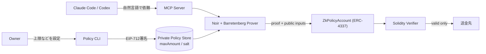

# ZK Policy Enforcement Layer

AIエージェントに秘密の支出ポリシーを渡さず、<br>ZK Proofで送金を強制するSmart Account基盤のPoC

<div class="pt-4 text-sm opacity-60">
Advanced Cryptography Program · Week 6<br>
発表 5分 ・ 質疑応答 2分
</div>

<!--
担当: (未定)
-->

---

# A-1 — サービス概要

## AIエージェントの送金を、ZK Proofで検証してから実行する

Claude CodeやCodexが提案した送金を、秘密の支出ポリシーに対するZK Proofで検証し、
条件を満たす場合だけSmart Accountから実行するPoCです。

- **対象**: AIエージェントが自然言語の依頼から生成する送金
- **検証**: 秘密の支出上限・有効期限・送金先やToken/Contractのallowlist・日次累積上限をZK Proofで検証
- **実行**: Proofが有効な場合だけ、ERC-4337 Smart Accountが送金を実行

<div class="grid grid-cols-3 gap-4 pt-8 text-sm">
  <div class="border rounded-lg p-3 opacity-80">
    <div class="text-xs opacity-60">Phase 1〜4</div>
    <div class="font-semibold">done</div>
  </div>
  <div class="border rounded-lg p-3 opacity-80">
    <div class="text-xs opacity-60">Phase 6</div>
    <div class="font-semibold">複数ポリシー対応（review）</div>
  </div>
  <div class="border rounded-lg p-3 opacity-80">
    <div class="text-xs opacity-60">対応条件</div>
    <div class="font-semibold">上限・期限・allowlist・日次累積</div>
  </div>
</div>

<!--
担当: (未定)
-->

---
layout: two-cols
---

# A-2 — サービス目的（世界観）

## エージェントに「財布」を持たせるには、信頼しなくていい仕組みが要る

### 従来のガードレール

- ルールをプロンプトやアプリコードで縛る
- ルールの中身をエージェント自身が読める
- Prompt Injectionや実装バグで越えられる余地が残る

::right::

<div class="pt-24">

### ZK Policyのガードレール

- ルールはOff-chainの秘密のまま保持する
- エージェントにもオンチェーンにも中身を見せない
- 「条件を満たした」ことだけをZK Proofで証明する

</div>

<!--
担当: (未定)

補足で下に一言添えるなら:
人間はPolicy CLIで支出の境界を設定するだけ。
以降エージェントは、その境界の中だけで自律的に送金できる。
-->

---

# A-3 — アーキテクチャ

## 秘密はOff-chainに残し、Proofだけがオンチェーンへ渡る



<div class="text-sm opacity-60 pt-2">
🔒 秘密（maxAmount / salt）はOff-chainだけで扱う ・ 公開されるのはProofと実送金額・Commitmentだけ
</div>

<!--
担当: (未定)
-->

---

# B-1 — 使用しているProgrammable Cryptography

## Noir + UltraHonk + Poseidon2 で「条件を満たした」ことだけを証明する

`Noir Circuit` → `Barretenberg (bb / bb.js)` → `UltraHonk Proof（EVM向けKeccak）` → `Solidity Verifier自動生成`

```
policyCommitment = Poseidon2(maxAmount, salt)
```

上限額は候補が少なく総当たりで推測されやすいため、Policyごとの秘密乱数`salt`をCommitmentに混ぜることで推測を困難にしている。

<div class="grid grid-cols-3 gap-4 pt-4 text-sm">
  <div class="border rounded-lg p-3">
    <b>Zero-Knowledge</b><br>
    <span class="opacity-70">ポリシーの中身を一切公開せずに、条件の充足だけをオンチェーンで強制できる</span>
  </div>
  <div class="border rounded-lg p-3">
    <b>Trustlessな検証</b><br>
    <span class="opacity-70">Solidity Verifierが第三者判定なしにEVM上で検証を完結できる</span>
  </div>
  <div class="border rounded-lg p-3">
    <b>段階的な拡張</b><br>
    <span class="opacity-70">Noirの制約記述で、有効期限・allowlist・日次累積上限まで条件を積み増せた</span>
  </div>
</div>

<div class="text-xs opacity-50 pt-6">
実測（複合Policy回路）: ACIR 4,314 / Brillig 87 ・ Proof 8,000 bytes ・ 生成 936ms（単発） ・ Circuit 11 / Contract 39 / E2E 27 tests
</div>

<!--
担当: (未定)
-->

---

# B-2 — デモ（正常系・異常系）

## 上限超過は「Proofが作れない」段階で止まる

<div class="grid grid-cols-2 gap-4 pt-4">

```bash
# 正常系
$ pnpm local:payment
# policy: maxAmount = 0.1 ETH (secret)
# payment: 0.01 ETH -> recipient
✔ proof generated
✔ verifier: valid
✔ balance +0.01 ETH
```

```bash
# 異常系
$ pnpm local:payment --value 1
# policy: maxAmount = 0.1 ETH (secret)
# payment: 1 ETH -> recipient
✘ circuit constraint violated
✘ proof not generated
# -> transaction未送信、残高変化なし
```

</div>

<div class="border rounded-lg p-4 mt-6 text-sm">
<b>Agent経由でも同じ境界:</b> Claude Code / Codexへ自然言語で送金を依頼 → MCP <code>pay_native</code> →
上限内は追加承認なしに成功、上限超過はUserOperation送信前に拒否。
秘密の<code>maxAmount</code>・<code>salt</code>はAgent transcriptにも一切出力しない。
</div>

<!--
担当: (未定)
-->

---

# B-3 — 将来像（ETH Global）

## PoCから、AIエージェント向けウォレット基盤へ

- **now** — 複数ポリシーで正常系は完了
  有効期限・送金先allowlist・Token/Contract allowlist・日次累積上限を、native・ERC-20・Contract決済で対応済み
- **next** — 攻撃・異常系の包括検証
  Prompt Injection由来の不正な送金提案が、オンチェーンで確実に拒否されることを実証する
- **next** — Safe Module経路（zk-bound）との接続検討
  自作Accountで得たAccount境界の理解を、本番寄りの実行境界へつなげる
- **later** — 複数チェーン・複数Agent対応
  同じ秘密ポリシーの境界を、複数チェーン・複数エージェントで共有できる基盤にする

<div class="border rounded-lg p-4 mt-8">
<b>Vision —</b> エージェントに鍵を渡さず、証明だけを渡す。そんなウォレットレイヤーを目指す。
</div>

<!--
担当: (未定)
-->

---
layout: center
class: text-left
---

# ご清聴ありがとうございました

ご質問をお願いします（質疑応答 2分）

<div class="pt-8 text-sm opacity-60">
GitHub: Komlock-lab / zk-policy-poc
</div>
